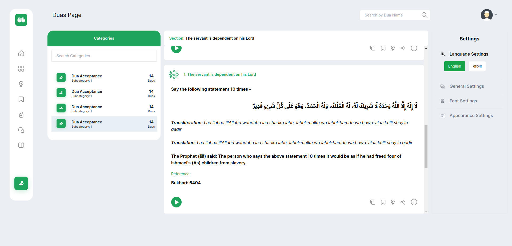

# Dua

A modern, responsive Dua application built with Next Js and Tailwind CSS

[Explore Dua](https://dua-gamma.vercel.app)




## Getting Started

### Prerequisites
- Node.js (version 22.11.0 or higher)
- npm or yarn package manager

### Installation

1. Clone the repository:
```bash
git clone https://github.com/takbirgazi/dua.git
cd dua
```

2. Install dependencies:
```bash
npm install
# or
yarn install
```

3. Start the development server:
```bash
npm run dev
# or
yarn dev
```

4. Open your browser and navigate to:
```
http://localhost:3000
```

### Dependencies

- Next Js
- React Icon(icons)
- Tailwind CSS (styling)

### Support

For support, please open an issue in the GitHub repository or contact the development team.